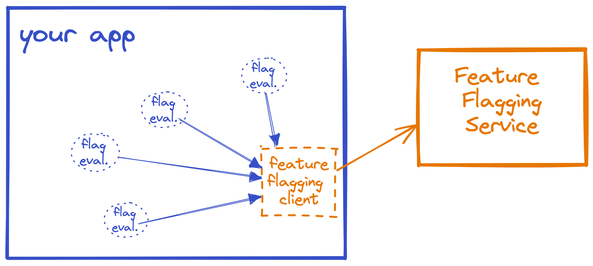

# Quarkus Open Feature Example

## [Open Feature][openfeature-doc], késako ?

OpenFeature is an open specification that provides a vendor-agnostic, community-driven API for feature flagging that works with your favorite feature flag management tool (or feature flag service).

OpenFeature provides a shared, standardized feature flagging client - an SDK - which can be plugged into various 3rd-party feature flagging providers. Whether you're using an open-source system or a commercial product, whether it's self-hosted or cloud-hosted, OpenFeature provides a consistent, unified API for developers to use feature flagging in their applications.

### A typical feature-flagging system



### OpenFeature integrated with a hypothetical "Flags-R-us" flag management system


## Concepts

### [Feature Toggles (aka Feature Flags)][feature-flags-blog-martin-fowler]
In the most basic case, you can think of a feature flag as an if/else statement that can be controlled at runtime. Feature flags allow application behavior to be altered without the deployment of new code.

A few general concepts :
- ***Toggle Point*** : This is the function or method in which the Feature Flags are evaluated.
- ***Toggle Router*** : It's the evaluation and decisions of the Feature Flags.
- ***Toggle Context*** : This is a set of metadata supplied to the Toggle Router to enable it to perform a dynamic evaluation.
- ***Toggle Configuration*** : Set of rules used by the Toggle Router to perform evaluations.


### [Evaluation API][openfeature-evaluation-api]
This is a set of APIs provided by the Open Feature SDK for evaluating Feature Flags. It'is Toggle Router

```java
Boolean boolValue = client.getBooleanValue("boolFlag", false);
String stringValue = client.getStringValue("stringFlag", "default");
Integer intValue = client.getIntegerValue("intFlag", 1);
Double doubleValue = client.getDoubleValue("doubleFlag", 0.9);
Value objectValue = client.getObjectValue("objectFlag", MyObjectInstance);
```

> ℹ️ The actual assessment is delegated to the service provider.

### [Providers][openfeature-providers]

Providers are responsible for performing flag evaluations. They provide an abstraction between the underlying flag management system and the OpenFeature SDK. 

```java
OpenFeatureAPI openFeatureAPI = OpenFeatureAPI.getInstance();

// Register go-feature-flag Provider
openFeatureAPI.setProvider(new dev.openfeature.contrib.providers.gofeatureflag.GoFeatureFlagProvider());
```

> ℹ️ We can implement our own provider, by implementing the `dev.openfeature.sdk.FeatureProvider`. In this case, we are responsible for developing the Feature Flag Service to store the Toggle Configuration.

You can find [Open Feature compatible providers][openfeature-ecosystem].

### [Evaluation Context][openfeature-evaluation-context]

The evaluation context is a container for arbitrary contextual data that can be used as a basis for dynamic evaluation. Static data such as the host or an identifier for the application can be configured globally. Dynamic evaluation context, such as the IP address of the client in a web application, can be implicitly propagated or explicitly passed to during flag evaluation, and can be merged with static values.

```java
// add a value to the global context
OpenFeatureAPI api = OpenFeatureAPI.getInstance();
api.setEvaluationContext(new MutableContext().add("myGlobalKey", "myGlobalValue"));

// add a value to the client context
Client client = api.getClient();
client.setEvaluationContext(new MutableContext().add("myClientKey", "myClientValue"));

// add a value to the invocation context
EvaluationContext context = new MutableContext();
context.addStringAttribute("myInvocationKey", "myInvocationValue")
Boolean boolValue = client.getBooleanValue("boolFlag", false, context);
```

### Hooks

### Events

### SDK Paradigms

### [OFREP (Open Feature Remote Evaluation Protocol)][openfeature-ofrep]

> ⚠️ OpenFeature Remote Evaluation Protocol is a WIP initiative, expect breaking changes ⚠️

OpenFeature Remote Flag Evaluation Protocol is an API specification for feature flagging that allows the use of generic providers to connect to any feature flag management systems that supports the protocol.

## Tests

### Open in Visual Studio Code ⤵️

[](https://vscode.dev/redirect?url=vscode://ms-vscode-remote.remote-containers/cloneInVolume?url=https://github.com/nzuguem/quarkus-open-feature)

For this demo, we are using 3 different providers :

- [Flagd][flagd-doc] -> [Config file](feature-flag-services/flagd/config/flags.flagd.json)
- [Go Feature Flag][goff-doc] -> [Config files](feature-flag-services/goff/config/)
- [Env Var][env-var-doc]

```bash
## Start application
quarkus dev

## Visit Quarkus Dev UI
http://localhost:8080/q/dev-ui/welcome
```

You can manipulate the various endpoints indicated in the Dev UI (***Resource Endpoints***)

## Resources

- [OpenFeature : La normalisation du feature flags ?][openfeature-devfest-nantes-2024-yt]

<!-- Links -->

[openfeature-devfest-nantes-2024-yt]: https://youtu.be/c1SXrrfdCt0?si=uA5hcAv7ayrytLE1
[flagd-doc]: https://flagd.dev/
[goff-doc]: https://gofeatureflag.org/
[env-var-doc]: https://github.com/open-feature/java-sdk-contrib/tree/main/providers/env-var
[openfeature-doc]: https://openfeature.dev/
[feature-flags-blog-martin-fowler]: https://martinfowler.com/articles/feature-toggles.html
[openfeature-ecosystem]: https://openfeature.dev/ecosystem
[openfeature-evaluation-api]: https://openfeature.dev/docs/reference/concepts/evaluation-api
[openfeature-providers]: https://openfeature.dev/docs/reference/concepts/provider
[openfeature-evaluation-context]: https://openfeature.dev/docs/reference/concepts/evaluation-context
[openfeature-ofrep]: https://gofeatureflag.org/docs/experimental/ofrep